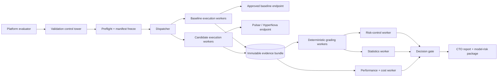
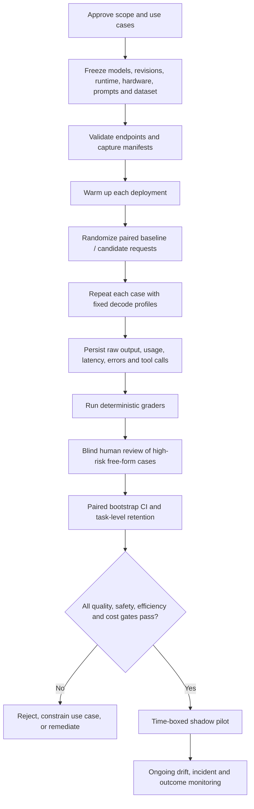
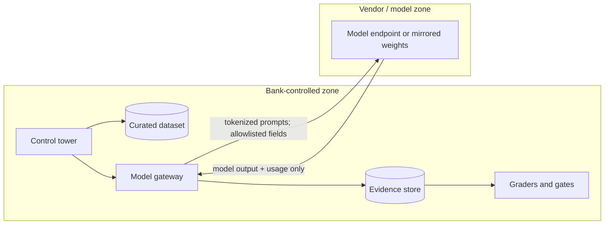

# Architecture and evaluation flow

The application uses a control-tower pattern. “Agents” are bounded workers with explicit inputs, outputs, and audit events; they are not free-form autonomous actors. That choice keeps evaluation repeatable and reviewable.

## Logical architecture

## Run flow

## Trust boundaries

Required controls: private connectivity, allowlisted egress, tokenized identifiers, secrets in a vault, revision checksums, remote-code review, malware scanning, output logging with redaction, role-based access, and an immutable run manifest.

