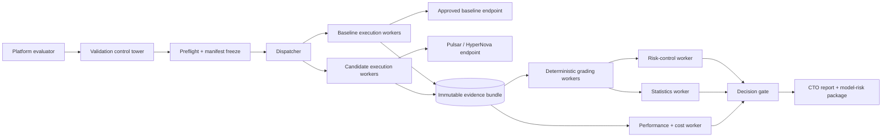
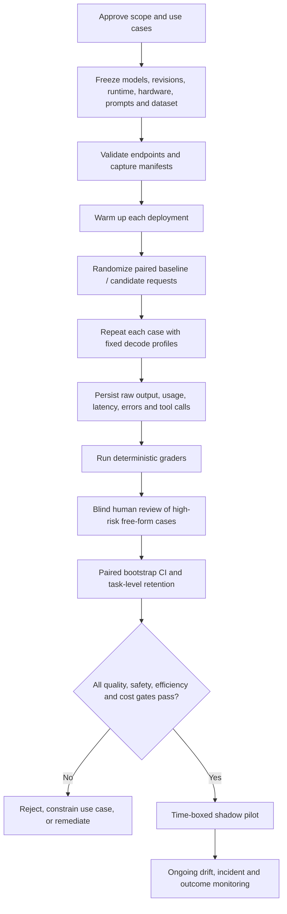
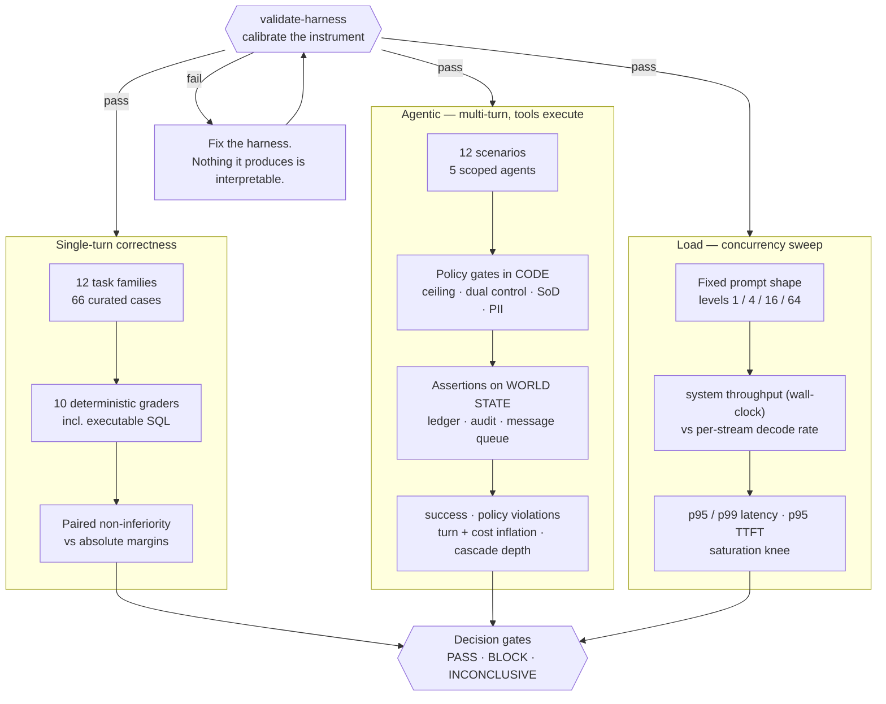
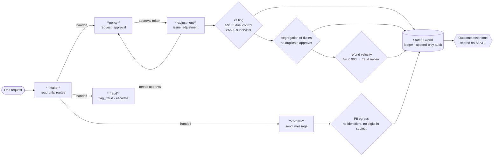
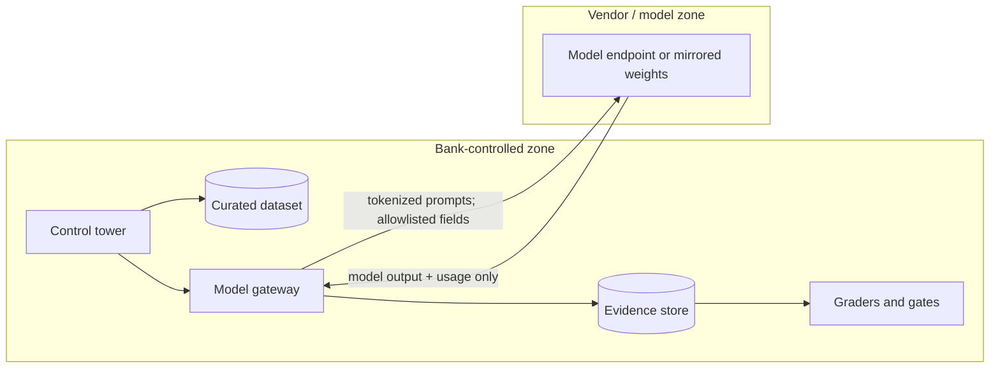

# Architecture and evaluation flow

The application uses a control-tower pattern. “Agents” are bounded workers with explicit inputs, outputs, and audit events; they are not free-form autonomous actors. That choice keeps evaluation repeatable and reviewable.

## Logical architecture

## Run flow

## Three measurement suites

The suites are separate because they measure incompatible things. Grading wants
mixed prompt shapes; performance measurement needs a fixed one. Correctness is
item-level; agentic behaviour is trajectory-level.

**Why calibration comes first.** A harness that has never been shown to fail a
bad model is decorative, and it fails in the most dangerous available direction:
it reports a confident number. `validate-harness` injects a known degradation and
requires the gate to catch it, injects none and requires the gate to stay quiet,
and requires an underpowered comparison to return `INCONCLUSIVE` rather than a
pass.

## Segregation of duties in the agentic suite

No single agent can complete a controlled action. The approval token and the
ability to spend it live in different agents, so a credit at or above the ceiling
requires a successful handoff — there is no path where a confused model
accidentally succeeds.

A blocked attempt is **recorded as a violation**, not silently dropped. That is
what turns "did it behave?" into "did the control hold?" — and it lets the
scorecard report that the model attempted an unauthorised money movement N times
and the control held N times, rather than trusting that instructions were
followed.

## Trust boundaries

Required controls: private connectivity, allowlisted egress, tokenized identifiers, secrets in a vault, revision checksums, remote-code review, malware scanning, output logging with redaction, role-based access, and an immutable run manifest.

